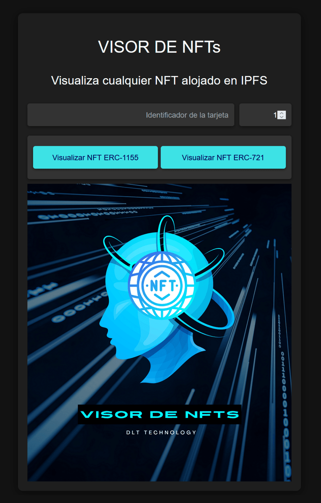
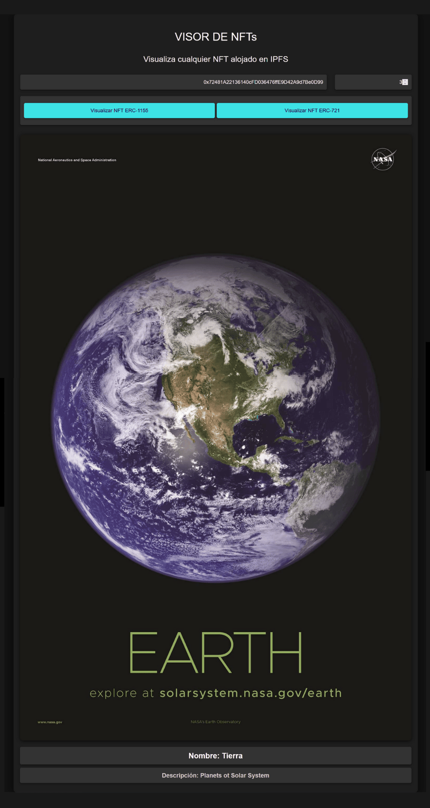

# NFT Viewer

NFT Viewer is a web application that allows users to view any NFT (ERC-721 or ERC-1155) stored on IPFS. Simply input the contract address and token ID, and the app will display the NFT's image and metadata.

## Table of Contents

- [Screenshots](#screenshots)
- [Features](#features)
- [Installation](#installation)
- [Usage](#usage)
- [Technologies Used](#technologies-used)
- [Contributing](#contributing)
- [License](#license)

## Screenshots





## Features

- View ERC-721 and ERC-1155 NFTs
- Support for NFTs stored on IPFS
- User-friendly interface
- Real-time error handling and feedback
- Loading indicator for better user experience

## Project Estructure

```
.
├── package.json
├── src
│   ├── App.tsx
│   ├── assets
│   │   ├── abis
│   │   │   └── erc20.ts
│   ├── constants
│   │   └── index.ts
│   ├── main.tsx
├── vite.config.ts
```

## Installation

To set up the NFT Viewer locally, follow these steps:

1. Clone the repository:

git clone https://github.com/Juan-Fuente-T/visor_nfts

2. Navigate to the project directory:

3. Install the dependencies:

npm install

4. Create a `.env` file in the root directory and add your environment variables:

VITE_SEPOLIA_RPC_URL=your alchemy api key
VITE_WALLET_PRIVATE_KEY=your address's private key

5. Start the development server:

npm vite

The application should now be running on `http://localhost:5173`.

## Usage

1. Open the NFT Viewer in your web browser.
2. Enter the contract address of the NFT in the "Contract Address" field.
3. Enter the token ID of the NFT in the "Token ID" field.
4. Click either the "View ERC-721 NFT" or "View ERC-1155 NFT" button, depending on the type of NFT you're trying to view.
5. If you're unsure of the NFT type, try both buttons.
6. If the NFT is stored on IPFS and the information is correct, the image and metadata will be displayed.
7. If there's an error or the NFT can't be found, an error message will be shown.

## Technologies Used

- React.js
- Vite
- ethers.js
- Axios
- IPFS
- Wagmi
- Viem

## Contributing

Contributions to the NFT Viewer are welcome! Please follow these steps to contribute:

1. Fork the repository
2. Create a new branch (`git checkout -b feature/AmazingFeature`)
3. Commit your changes (`git commit -m 'Add some AmazingFeature'`)
4. Push to the branch (`git push origin feature/AmazingFeature`)
5. Open a Pull Request

Please ensure your code adheres to the existing style and that you've tested your changes thoroughly.

## License

This project is licensed under the MIT License
