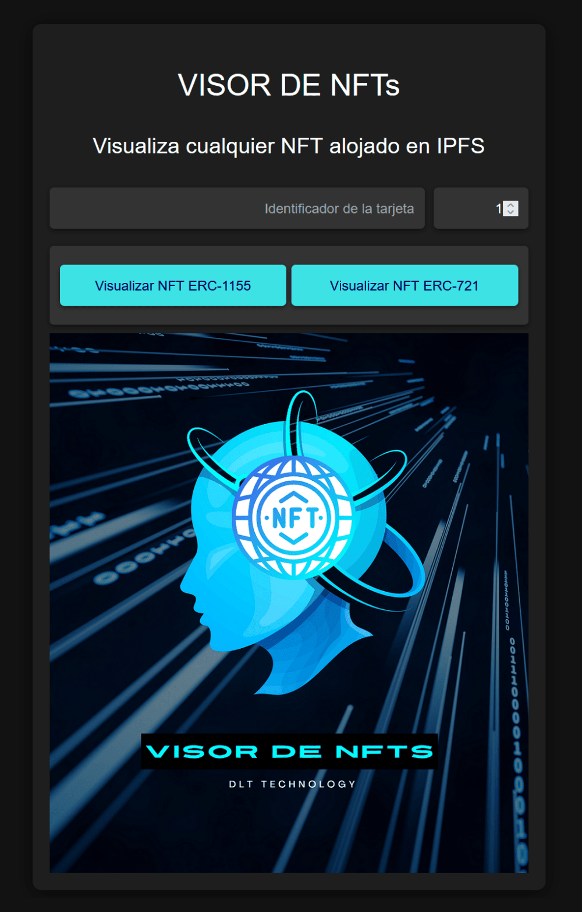

# Visor de NFTs

El Visor de NFTs es una aplicación web que permite a los usuarios ver cualquier NFT (ERC-721 o ERC-1155) almacenado en IPFS. Simplemente ingrese la dirección del contrato y el ID del token, y la aplicación mostrará la imagen y los metadatos del NFT.

## Tabla de Contenidos

- [Capturas de pantalla](#capturas-de-pantalla)
- [Características](#características)
- [Instalación](#instalación)
- [Uso](#uso)
- [Tecnologías Utilizadas](#tecnologías-utilizadas)
- [Contribuir](#contribuir)
- [Licencia](#licencia)

## Capturas de pantalla

## Características

- Visualización de NFTs ERC-721 y ERC-1155
- Soporte para NFTs almacenados en IPFS
- Interfaz amigable para el usuario
- Manejo de errores y retroalimentación en tiempo real
- Indicador de carga para una mejor experiencia de usuario

## Estructura del Proyecto

.
├── package.json
├── src
│ ├── App.tsx
│ ├── assets
│ │ ├── abis
│ │ │ └── erc20.ts
│ ├── constants
│ │ └── index.ts
│ ├── main.tsx
├── vite.config.ts

## Instalación

Para configurar el Visor de NFTs localmente, siga estos pasos:

1. Clone el repositorio:

git clone https://github.com/Juan-Fuente-T/visor_nfts

2. Navegue al directorio del proyecto:

3. Instale las dependencias:

npm install

4. Cree un archivo `.env` en el directorio raíz y añada sus variables de entorno:

VITE_SEPOLIA_RPC_URL=su clave api de alchemy
VITE_WALLET_PRIVATE_KEY=la clave privada de su dirección

5. Inicie el servidor de desarrollo:

npm vite

La aplicación debería estar ahora ejecutándose en `http://localhost:5173`.

## Uso

1. Abra el Visor de NFTs en su navegador web.
2. Ingrese la dirección del contrato del NFT en el campo "Dirección del Contrato".
3. Ingrese el ID del token del NFT en el campo "ID del Token".
4. Haga clic en el botón "Ver NFT ERC-721" o "Ver NFT ERC-1155", dependiendo del tipo de NFT que esté intentando ver.
5. Si no está seguro del tipo de NFT, pruebe ambos botones.
6. Si el NFT está almacenado en IPFS y la información es correcta, se mostrará la imagen y los metadatos.
7. Si hay un error o no se puede encontrar el NFT, se mostrará un mensaje de error.

## Tecnologías Utilizadas

- React.js
- Vite
- ethers.js
- Axios
- IPFS
- Wagmi
- Viem

## Contribuir

¡Las contribuciones al Visor de NFTs son bienvenidas! Por favor, siga estos pasos para contribuir:

1. Haga un fork del repositorio
2. Cree una nueva rama (`git checkout -b feature/CaracteristicaIncreible`)
3. Haga commit de sus cambios (`git commit -m 'Añadir alguna CaracteristicaIncreible'`)
4. Haga push a la rama (`git push origin feature/CaracteristicaIncreible`)
5. Abra una Pull Request

Por favor, asegúrese de que su código se adhiere al estilo existente y que ha probado sus cambios a fondo.

## Licencia

Este proyecto está licenciado bajo la Licencia MIT
